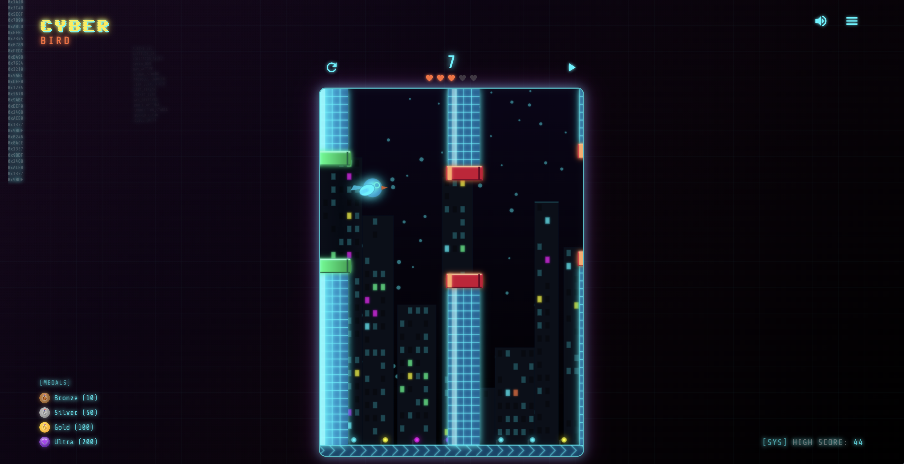
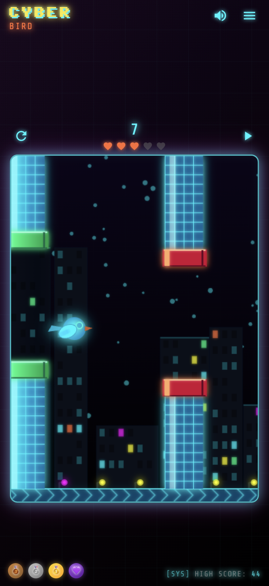
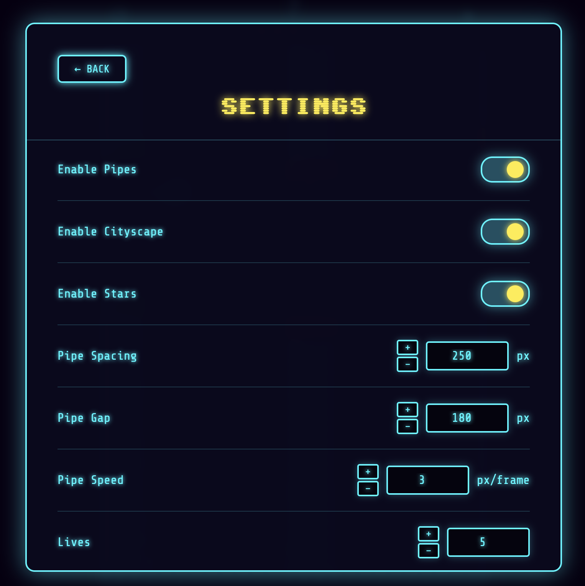
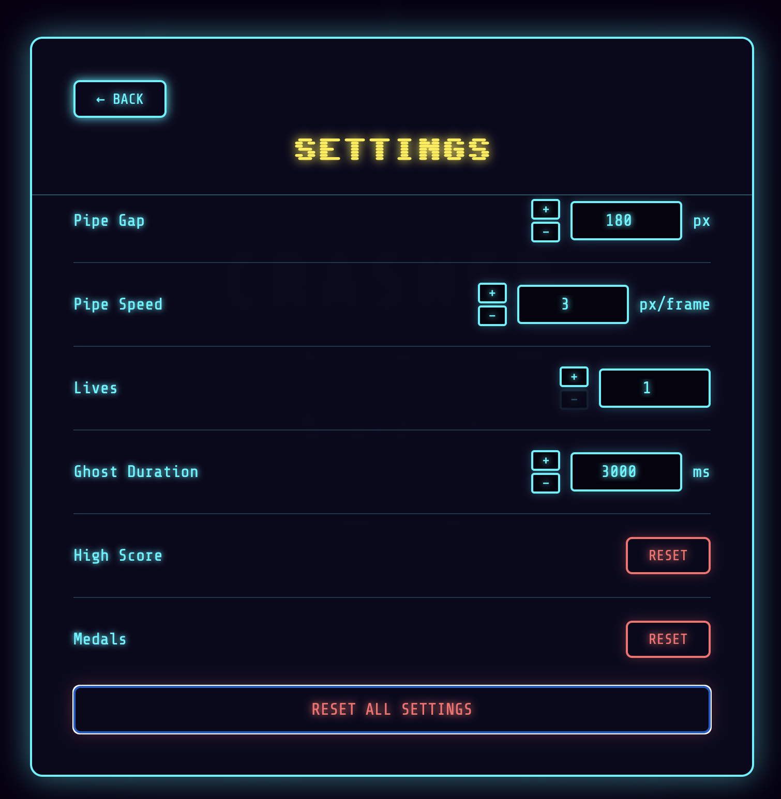
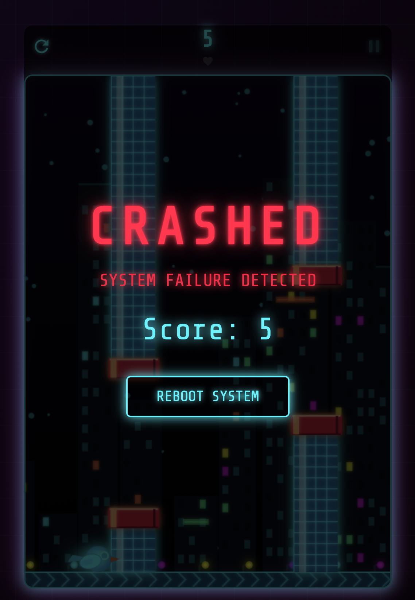

# Cyber Bird 🐦

A cyberpunk-themed Flappy Bird game with neon visuals, smooth animations, and customizable gameplay. Fly through the neon cityscape and avoid obstacles in this retro-futuristic adventure!


## 📸 Screenshots

<div align="center">
  
  **Main Gameplay**
  
  
  
  <br/><br/>
  
  **Additional Views**
  
  <table>
    <tr>
      <td align="center">
        <br/>
        <sub>Mobile View</sub>
      </td>
      <td align="center">
        <br/>
        <sub>Settings Menu 1</sub>
      </td>
      <td align="center">
        <br/>
        <sub>Settings Menu 2</sub>
      </td>
      <td align="center">
        <br/>
        <sub>Game Over</sub>
      </td>
    </tr>
  </table>
  
</div>

## 🎮 Features

### Core Gameplay
- **Classic Flappy Bird Mechanics**: Navigate through obstacles by timing your jumps perfectly
- **Lives System**: Start with multiple lives (configurable 1-10)
  - Visual hearts display showing remaining lives
  - Hearts grey out when lives are lost
- **Ghost Mode**: When you lose a life (but have more remaining), enter ghost mode for temporary invincibility
  - Configurable duration (500-5000ms)
  - Flickering visual effect during ghost mode
- **Score System**: Track your score and compete for high scores
- **High Score Persistence**: Your high score is saved locally
- **Medal System**: Earn achievements as you progress
  - 🥉 **Bronze Medal**: Score 10 points
  - 🥈 **Silver Medal**: Score 50 points
  - 🥇 **Gold Medal**: Score 100 points
  - 💜 **Ultra Medal**: Score 200 points
  - Medal notifications with sound effects
  - Medal display showing earned achievements

### Visual Features
- **Cyberpunk Aesthetic**: Neon blue and orange color scheme with glowing effects
- **Parallax Scrolling Background**:
  - Animated stars (can be toggled on/off)
  - Dense star field with smooth parallax movement
  - Neon cityscape with buildings (can be toggled on/off)
  - Building windows with dynamic lighting
  - Neon signs on buildings
  - Street lights with glowing effects
  - All background elements move at different speeds for depth
- **Animated Bird**: 
  - Smooth wing flapping animation
  - Random blinking animation for personality
  - Rotation based on velocity
  - Wing shadow for depth
  - Pointed wing design with rounded edges
  - Feather texture details
- **Textured Ground**: Scrolling chevron pattern with parallax effect
- **Glowing Pipes**: Neon obstacles with grid patterns and color-coded caps
  - Green caps for unpassed pipes
  - Red caps for passed pipes
  - 3D-style cap rendering
- **Visual Effects**: 
  - Glitch effects on restart
  - Shadows and smooth transitions
  - Transparent pipes when hit
  - Game over overlay

### Customization & Settings
- **Adjustable Difficulty**: 
  - Pipe spacing (150-500px) with +/- buttons
  - Pipe gap size (100-300px) with +/- buttons
  - Pipe speed (1-10 px/frame) with +/- buttons
- **Lives Configuration**: Set the number of lives (1-10) with +/- buttons
- **Ghost Duration**: Adjust how long ghost mode lasts (500-5000ms) with +/- buttons
- **Toggle Options**:
  - Enable/disable pipes for practice mode
  - Enable/disable cityscape background
  - Enable/disable stars background
- **Reset Options**: 
  - Reset individual settings to defaults
  - Reset all settings at once
  - Reset high score
  - Reset medals
- **Mobile-Friendly Controls**: Increment/decrement buttons for all number inputs

### Sound System
- **Sound Effects**:
  - Wing flapping sound
  - Score point sound (ascending tones)
  - Crash sound (when losing last life)
  - Disconnect sound (when losing a life but continuing)
  - Medal achievement sound (Xbox-style triumphant chime)
  - Reboot/restart sound
- **Sound Toggle**: Enable/disable all sounds
- **Auto-Resume**: Audio automatically resumes on iOS when suspended
- **Persistent Settings**: Sound preferences saved locally

### Controls
- **Spacebar** or **Click/Tap**: Make the bird fly up
- **Enter**: Pause/Resume the game
- **Two-Finger Tap** (Mobile): Pause/Resume
- **Menu Button**: Access settings and how-to-play guide
- **Restart Button**: Restart the current game
- **Sound Toggle**: Enable/disable sound effects
- **Settings Navigation**: Back buttons and menu system

### Progressive Web App (PWA)
- **Installable**: Add to home screen on iOS and Android
- **App Icon**: Custom Cyber Bird logo
- **Standalone Mode**: Runs as a fullscreen app
- **Theme Color**: Matches game's dark cyberpunk aesthetic
- **Status Bar**: Transparent status bar that blends with stars background
- **Manifest**: Complete web app manifest for PWA support

## 🎯 How to Play

1. **Start the Game**: Click or tap to begin, or press Spacebar
2. **Navigate**: Keep the bird flying by pressing Spacebar or clicking/tapping
3. **Avoid Obstacles**: Fly through the gaps between pipes
4. **Score Points**: Each pipe you pass gives you one point
5. **Earn Medals**: Reach score milestones to unlock achievements
6. **Survive**: Don't hit the pipes or the ground!
7. **Use Lives**: With multiple lives, you'll enter ghost mode when hit (if lives remain)

### Tips
- Don't fly too high or too low
- Time your jumps carefully
- Use ghost mode strategically when you have multiple lives
- Practice makes perfect!
- Try different difficulty settings to find your sweet spot
- Disable pipes to practice flying mechanics

## ⚙️ Settings

Access the settings menu to customize your gameplay experience:

### Gameplay Settings
- **Enable Pipes**: Toggle obstacles on/off
- **Pipe Spacing** (150-500px): Distance between pipes
- **Pipe Gap** (100-300px): Size of the gap between top and bottom pipes
- **Pipe Speed** (1-10 px/frame): How fast pipes move
- **Lives** (1-10): Number of lives you start with
- **Ghost Duration** (500-5000ms): How long ghost mode lasts

### Visual Settings
- **Enable Cityscape**: Toggle the neon cityscape background
- **Enable Stars**: Toggle the starfield background

### Data Management
- **Reset High Score**: Clear your saved high score
- **Reset Medals**: Clear all earned medals
- **Reset All Settings**: Restore all settings to defaults

All settings are saved automatically and persist between sessions. Use the +/- buttons for easy adjustment on mobile devices.

## 🏆 Medal System

Earn medals by reaching score milestones:

- **🥉 Bronze Medal**: Score 10 points
- **🥈 Silver Medal**: Score 50 points
- **🥇 Gold Medal**: Score 100 points
- **💜 Ultra Medal**: Score 200 points

When you earn a medal:
- A notification appears with the medal emoji and name
- A triumphant achievement sound plays
- The medal is saved and displayed in the medals list
- Earned medals show as filled icons, unearned as transparent

## 🚀 Getting Started

### Installation

No installation required! This is a single-file HTML5 game that runs entirely in your browser.

1. Clone or download this repository
2. Open `index.html` in any modern web browser
3. Start playing!

### Requirements

- Modern web browser (Chrome, Firefox, Safari, Edge)
- JavaScript enabled
- No additional dependencies or build process needed

### Mobile Support

The game is fully responsive and optimized for mobile devices:
- Touch controls for tap-to-fly
- Two-finger tap to pause
- Responsive canvas sizing
- Mobile-friendly UI with increment/decrement buttons
- Optimized medal display (icons only on mobile)
- PWA support for home screen installation

### Adding to Home Screen (iOS)

1. Open the game in Safari
2. Tap the Share button
3. Select "Add to Home Screen"
4. The game will appear as an app icon with the Cyber Bird logo
5. Launch it like a native app!

### Adding to Home Screen (Android)

1. Open the game in Chrome
2. Tap the menu (three dots)
3. Select "Add to Home Screen" or "Install App"
4. The game will be installed as a PWA

## 🎨 Technical Details

### Technologies Used
- **HTML5 Canvas**: For rendering game graphics
- **Vanilla JavaScript**: No frameworks required
- **CSS3**: Styling and animations
- **Web Audio API**: Sound effects with auto-resume on iOS
- **LocalStorage**: Save settings, high scores, and medals
- **PWA Manifest**: Web app manifest for installability

### Performance Optimizations
- Offscreen canvas caching for ground patterns
- Cached gradients for pipes, bird, sky, and buildings
- Frame-rate independent movement using delta time
- Efficient collision detection with hit tracking
- Optimized rendering pipeline
- Batched drawing operations (stars, feathers, pipe grids)
- Simplified calculations for better performance

### Browser Compatibility
- Chrome/Edge (Recommended)
- Firefox
- Safari (including iOS)
- Opera

### Mobile Optimizations
- Fixed logical canvas size for consistent element scaling
- Responsive display scaling
- Touch-optimized controls
- Mobile-specific UI adjustments
- Audio context auto-resume on iOS

## 📝 Game States

- **Paused**: Game is paused, can be resumed
- **Playing**: Active gameplay
- **Falling**: Bird is falling after losing last life
- **Game Over**: Game has ended, can restart

## 🎵 Sound Effects

The game includes sound effects for:
- **Wing Flapping**: Quick tone when bird flaps
- **Scoring Points**: Ascending two-tone chime
- **Crash**: Descending sawtooth tones (last life lost)
- **Disconnect**: Short glitchy sound (life lost, continuing)
- **Medal Achievement**: Xbox-style triumphant ascending chord
- **Reboot/Restart**: Power-on glitch sound effect

Sound can be toggled on/off via the sound button in the top controls. All sounds are generated using the Web Audio API for crisp, responsive audio.

## 🏆 Scoring & Achievements

- **Points**: Earn 1 point for each pipe you successfully pass
- **High Score**: Your best score is automatically saved
- **Medals**: Earn medals at score milestones (10, 50, 100, 200 points)
- **Reset Options**: High score and medals can be reset from the settings menu

## 🎨 Visual Design

### Color Palette
- **Primary Neon**: `#00f5ff` (Cyan)
- **Secondary**: `#ffeb3b` (Yellow)
- **Accent**: `#ff6b35` (Orange)
- **Background**: Dark purple-black gradients
- **Text**: Neon cyan with glow effects

### Typography
- **Title**: 'Sixtyfour' font (pixelated)
- **UI**: 'Share Tech Mono' (monospace, cyberpunk feel)

### Effects
- Neon glows on all interactive elements
- Shadow effects for depth
- Smooth transitions and animations
- Parallax scrolling for immersive depth

## 🐛 Known Features

- Random blinking animation adds personality to the bird
- Smooth parallax scrolling creates depth
- Ghost mode provides a second chance when you have multiple lives
- Pipes become transparent when hit for better visibility
- Game over screen shows your final score with a subtle overlay
- Medal notifications appear in top-right corner (non-blocking)
- Settings persist across browser sessions
- Audio automatically resumes on iOS when suspended

## 📁 Project Structure

```
cyber-bird/
├── index.html          # Main game file (all-in-one)
├── manifest.json       # PWA manifest
├── README.md          # This file
└── media/
    └── cyber-bird-logo.png  # App icon/logo
```

## 📄 License

This project is open source and available for personal and educational use.

## 🤝 Contributing

Contributions, issues, and feature requests are welcome! Feel free to check the issues page.

## 🙏 Acknowledgments

- Inspired by the classic Flappy Bird game
- Built with modern web technologies
- Cyberpunk aesthetic inspired by retro-futuristic design
- Sound design inspired by classic arcade and Xbox achievements

---

**Enjoy flying through the neon cityscape!** ✨
